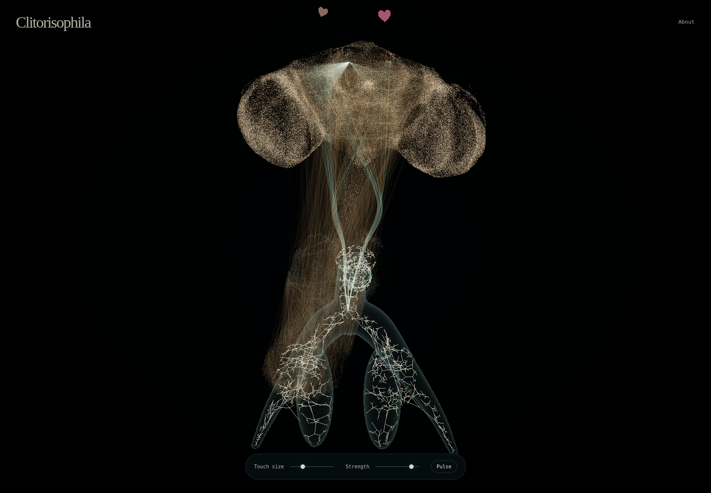

# Clitorisophila

A human shape, a fly’s wiring, an invented connection. Touch the branches and follow the light.

**[Open the artwork](https://meow-meow.io/clitorisophila/)** — it starts automatically. Click or drag across the nerves and adjust the touch size. Floating hearts follow computed reward activity.



[Facebook GIF](assets/social/clitorisophila-facebook.gif) · [MP4](assets/social/clitorisophila-facebook.mp4) · [Browser build and assumptions](docs/browser-artwork.md)

**A live synthetic clitoral stimulation → fly-connectome reinforcement interface.** Import it into a game, installation, virtual body or sensor loop. Neural activity and candidate synaptic memory persist between ticks and across checkpoints.

A fork of [Stonkfly](https://github.com/nftechie/stonkfly), the Bitcoin demo, built on [DOOMFLY](https://github.com/nftechie/doomfly). Full mode retains its MaleCNS v1.0 graph: **166,700 neurons and 25,582,938 directed connections**. MIT-licensed code; connectome data is downloaded separately.

```text
UI / sensor / host action
         ↓
virtual clitoral region + intensity
         ↓
sensory current + delayed PAM11 reward current
         ↓
persistent fly dynamics + candidate KC→MBON learning
         ↓
spikes / readouts → your host's next action → repeat
```

## Try the interface without a dataset

Python ≥3.11, C++17 compiler, Linux/macOS:

```sh
git clone https://github.com/0xmeowmeow/clitorisophila.git
cd clitorisophila
python3 -m venv .venv
source .venv/bin/activate
pip install -e .
clitorisophila demo
```

Ctrl-C stops it. This offline demo uses a **synthetic six-cell test circuit**, running the same native kernel and memory rule. It is not a reduced biological connectome. For a host-owned feedback example: `python examples/closed_loop.py`.

## Run the full fly live

Allow several GB of disk space and memory; 16 GB RAM is recommended for the full dataset preparation and simulator.

```sh
pip install -e '.[connectome]'
clitorisophila prepare      # ~1.1 GB source downloads; checksums verified
clitorisophila mapping --out mapping.json
python examples/stream_input.py | clitorisophila live --mapping mapping.json
```

Live input is newline-delimited JSON. Refresh while stimulation is held; omitted regions are released:

```json
{"schema":"clitorisophila.input.v1","channels":{"glans":0.8,"hood":0.2}}
```

The brain continues ticking during silence. Stale input releases touch after 250 ms; delayed rewards already scheduled finish delivering. Output is one JSON record per tick. Start with `--backend fixture` for integration development. Use `--no-reward` and `--frozen` for controls.

## Embed it

```python
from clitorisophila import Frame, Loop
from clitorisophila.native import full_backend, synthetic_gateway

backend = full_backend()  # after prepare; construct once
loop = Loop(backend, synthetic_gateway(backend))

# Call repeatedly from your application's simulation loop.
result = loop.step(Frame({"glans": 0.8}))
rates = result["readout_hz"]
loop.step()               # release stimulation; brain/memory keep running
loop.checkpoint("runs/session-001")
```

You own action decoding and feed the next stimulation back in. The package does not prescribe an agent's decisions. [Integration, mappings and checkpoints](docs/integration.md).

**What is modeled:** configurable synthetic touch encoding, reward-associated neuron stimulation, spike propagation and candidate plasticity. **What is not established:** felt pleasure, human–fly anatomical homology, or learned reward-seeking. The [2026 clitoral anatomy preprint](https://www.biorxiv.org/content/10.64898/2026.03.18.712572v1) motivates the interface; its scans and segmented nerve routes are not included. The named regions are virtual ports, not reconstructed human anatomy. [Model assumptions](docs/clitorisophila-model.md) · [Validation](docs/clitorisophila-validation.md) · [Upstream attribution](THIRD_PARTY.md).
